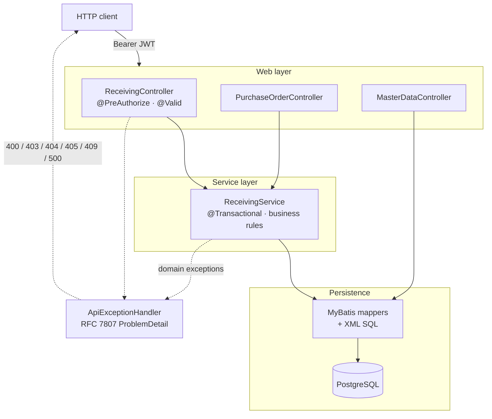

# Warehouse Receiving API

A REST API for the **receiving** step of warehouse operations: a delivery arrives against a purchase
order, a clerk records what physically showed up, and stock becomes available for picking.

Receiving looks like simple CRUD until you meet the real cases. Deliveries arrive **partially**, over
several trips. Suppliers ship **more than you ordered**. Boxes arrive **damaged** — those units
physically exist but must never become sellable stock. Two clerks can scan the same pallet at the same
moment. This service is built around those cases rather than around the happy path.

[](https://github.com/Davidzent/Warehouse-API/actions/workflows/maven.yml)

Java 17 · Spring Boot 4.1 · MyBatis · PostgreSQL · Docker

**Live:** [warehouse.zntsns.com](https://warehouse.zntsns.com) — deployed on Render against Supabase
PostgreSQL. First request after idle takes 30–60s (free tier cold start).

---

## Contents

- [Architecture](#architecture)
- [Business rules](#business-rules)
- [Endpoints](#endpoints)
- [Error contract](#error-contract)
- [Quickstart](#quickstart)
- [Run with Docker](#run-with-docker)
- [Walk the interesting paths](#walk-the-interesting-paths)
- [Testing](#testing)
  - [Continuous integration](#continuous-integration)
- [Deployment](#deployment)
- [Design decisions](#design-decisions)
- [Known limitations](#known-limitations)

---

## Architecture



Four layers, one direction. Domain exceptions are thrown where the rule lives — in the service — and
translated to HTTP in exactly one place, so no controller contains a status-code decision.

```
src/main/java/com/warehouse/receiving/
├── config/       SecurityConfig — JWT decoding, roles claim, method security
├── domain/       Vendor, Product, Location, PurchaseOrder(+Line), Receipt(+Line), Inventory, PoStatus
├── dto/          request/response records — deliberately narrower than the domain
├── mapper/       MyBatis interfaces (SQL lives in resources/mybatis/*.xml)
├── service/      ReceivingService + domain exceptions
└── web/          controllers + ApiExceptionHandler
```

---

## Business rules

These are the reason the service layer exists. All are enforced server-side and covered by tests.

| Rule | Behaviour |
|---|---|
| **Over-receipt tolerance** | Cumulative received quantity may reach **110%** of ordered. Beyond that → `409`. |
| **Damaged units** | Counted as received — they did arrive, and the running total is gross — but **never added to inventory**. Only `received − damaged` becomes usable stock. |
| **Receivable states** | Only `OPEN` and `PARTIALLY_RECEIVED` POs accept deliveries. `CLOSED` / `CANCELLED` → `409`. |
| **Status transitions** | After a receipt the PO becomes `CLOSED` when every line has met its ordered quantity, otherwise `PARTIALLY_RECEIVED`. |
| **Duplicate lines** | The same `poLineId` twice in one request → `400`. Quantities must be merged by the caller; silently summing would hide a client bug. |
| **Line ownership** | A `poLineId` belonging to a different PO → `400`. |
| **Damaged ≤ received** | Enforced at the DTO (`@AssertTrue`) *and* by a database `CHECK` constraint. |
| **Clerk identity** | `received_by` comes from the **verified JWT subject**, never from the request body. |

Over-receipt uses integer arithmetic on purpose:

```java
// total > ordered * 110%   <=>   total * 100 > ordered * 110
if (totalAfter * 100L > (long) poLine.getQuantityOrdered() * OVER_RECEIPT_PERCENT) { ... }
```

`0.1` is not representable in binary floating point, so `ordered * 1.1` can land a unit either side of
the boundary. Multiplying instead of dividing keeps the comparison exact.

---

## Endpoints

All routes require a bearer token except `/api/auth/**`.

| Method | Path | Role | Purpose |
|---|---|---|---|
| `POST` | `/api/receipts` | `WAREHOUSE_CLERK` | Record a delivery. `201` + `Location` header. |
| `GET` | `/api/receipts/{receiptId}` | any authenticated | Receipt detail. |
| `GET` | `/api/purchase-orders/{poId}` | any authenticated | PO with lines and running totals. |
| `GET` | `/api/locations` | any authenticated | Put-away locations. |
| `GET` | `/api/inventory` | any authenticated | Current stock on hand. |
| `POST` | `/api/auth/dev-token` | — | **`dev` profile only.** Mints a test token. |

### Recording a receipt

```http
POST /api/receipts
Authorization: Bearer <token>
Content-Type: application/json
```

```json
{
  "purchaseOrderId": 1000,
  "carrierReference": "BOL-99123",
  "notes": "Two pallets, one shrink-wrap torn",
  "lines": [
    { "poLineId": 2000, "quantityReceived": 50, "quantityDamaged": 2, "locationId": 101 }
  ]
}
```

`201 Created`, `Location: /api/receipts/5001`:

```json
{
  "receiptId": 5001,
  "purchaseOrderId": 1000,
  "purchaseOrderStatusAfter": "PARTIALLY_RECEIVED",
  "receivedBy": "dgtest",
  "receivedAt": "2026-07-31T18:04:11.512Z",
  "lines": [
    { "poLineId": 2000, "sku": "SKU-BOLT-M8", "quantityReceived": 50,
      "quantityDamaged": 2, "goodQuantity": 48, "locationId": 101 }
  ]
}
```

48 units reach inventory; the PO line's running total advances by the gross 50.

---

## Error contract

Every failure returns [RFC 7807](https://datatracker.ietf.org/doc/html/rfc7807) `ProblemDetail`.

| Status | Meaning | Example trigger |
|---|---|---|
| `400` | The **request** is wrong — fix and retry | validation failure, malformed JSON, duplicate line, line on another PO |
| `401` | No or invalid token | missing `Authorization` header |
| `403` | Valid token, insufficient role | `VIEWER` posting a receipt |
| `404` | Resource or route does not exist | unknown PO id, unmapped path |
| `405` | Route exists, wrong verb | `GET` on `/api/receipts` — response carries an `Allow` header |
| `409` | Request is fine, business **state** forbids it | receiving on a `CLOSED` PO, breaching the 110% cap |
| `500` | Our bug — logged server-side, never leaks internals | — |

Validation failures name every offending field:

```json
{
  "type": "about:blank",
  "title": "Validation Error",
  "status": 400,
  "detail": "Request validation failed",
  "fieldErrors": {
    "purchaseOrderId": "purchaseOrderId is required",
    "lines[0].quantityReceived": "quantityReceived must be at least 1"
  }
}
```

Framework-level failures (unmapped route, wrong verb) are mapped explicitly rather than falling into
the `500` catch-all — a generic handler that swallows `NoResourceFoundException` turns every typo into
a fake server error.

---

## Quickstart

**Prerequisites:** JDK 17+ and a PostgreSQL database named `warehouse`.

```bash
createdb warehouse
```

### Create the schema

`spring.sql.init.mode` is **`never`**, so the app does not touch your schema on startup. Load it once:

```bash
psql -d warehouse -f src/main/resources/schema.sql
psql -d warehouse -f src/main/resources/data.sql
```

To reseed on every boot instead — useful while the schema is still moving — run with
`--spring.sql.init.mode=always`. Note that `schema.sql` **drops and recreates every table**, so point
that at nothing you care about.

### Environment

```bash
export DB_PASSWORD='your-postgres-password'
export JWT_SECRET="$(openssl rand -base64 48)"
```

`JWT_SECRET` must be **at least 32 bytes** — HS256 rejects anything shorter, and the app fails at
startup rather than booting with an undersized key. A development fallback exists in
`application.yml` so a fresh clone runs, but any deployment must override it.

### Run

The default profile is **`prod`**, which excludes the dev token endpoint. For local work, activate
`dev`:

```bash
./mvnw spring-boot:run -Dspring-boot.run.profiles=dev     # Windows: mvnw.cmd
```

Serves on `http://localhost:8080`.

### Get a token

```bash
curl -s localhost:8080/api/auth/dev-token \
  -H 'Content-Type: application/json' \
  -d '{"username":"dgtest","role":"CLERK"}'
```

`role` is `CLERK` or `VIEWER`; anything else is rejected as `400`. `username` becomes `received_by` on
every receipt that token records. Tokens last 8 hours.

```bash
TOKEN=$(curl -s localhost:8080/api/auth/dev-token \
  -H 'Content-Type: application/json' \
  -d '{"username":"dgtest","role":"CLERK"}' | sed 's/.*"token":"\([^"]*\)".*/\1/')

curl -s localhost:8080/api/purchase-orders/1000 -H "Authorization: Bearer $TOKEN"
```

### Seed data

| PO | Status | Lines — ordered / already received |
|---|---|---|
| `1000` | `OPEN` | `2000` 50/0 · `2001` 200/0 · `2002` 40/0 |
| `1001` | `PARTIALLY_RECEIVED` | `2010` 20/5 · `2011` 10/0 |
| `1002` | `CLOSED` | `2020` 10/10 |
| `1003` | `CANCELLED` | — |

Locations: `100` DOCK-01 · `101` A-01-01 · `102` A-01-02 · `103` QC-HOLD (quarantine).

---

## Run with Docker

The compose stack brings up the API and its own PostgreSQL — no local database required.

```bash
cp .env.example .env      # then fill in the values
docker compose up --build
```

`.env` supplies:

```
DB_PASSWORD=warehouse
JWT_SECRET=<32+ characters>
SPRING_PROFILES_ACTIVE=dev
```

The `Dockerfile` is multi-stage: Maven builds the jar, and only a JRE plus the artifact ship in the
final image — roughly 200 MB instead of 800 MB.

Note that inside the compose network the database host is `db`, not `localhost` — the app reaches it
through `SPRING_DATASOURCE_URL`, which overrides `application.yml` via Spring's relaxed binding. The
same image therefore runs unchanged locally, in compose, and in production.

---

## Walk the interesting paths

The seed data exists to make every rule reachable from the command line. With `$TOKEN` holding a
`CLERK` token:

**Over-receipt → `409`.** Line 2000 ordered 50, so the cap is 55.

```bash
curl -i -X POST localhost:8080/api/receipts -H "Authorization: Bearer $TOKEN" \
  -H 'Content-Type: application/json' \
  -d '{"purchaseOrderId":1000,"lines":[{"poLineId":2000,"quantityReceived":56,"quantityDamaged":0,"locationId":101}]}'
```

**Closed PO → `409`.** PO 1002 is already complete.

```bash
curl -i -X POST localhost:8080/api/receipts -H "Authorization: Bearer $TOKEN" \
  -H 'Content-Type: application/json' \
  -d '{"purchaseOrderId":1002,"lines":[{"poLineId":2020,"quantityReceived":1,"quantityDamaged":0,"locationId":101}]}'
```

**Duplicate line → `400`.**

```bash
curl -i -X POST localhost:8080/api/receipts -H "Authorization: Bearer $TOKEN" \
  -H 'Content-Type: application/json' \
  -d '{"purchaseOrderId":1000,"lines":[{"poLineId":2001,"quantityReceived":10,"quantityDamaged":0,"locationId":101},{"poLineId":2001,"quantityReceived":5,"quantityDamaged":0,"locationId":101}]}'
```

**Damaged units never reach stock.** Receive 10 with 4 damaged, then read inventory — 6 units moved.

```bash
curl -s -X POST localhost:8080/api/receipts -H "Authorization: Bearer $TOKEN" \
  -H 'Content-Type: application/json' \
  -d '{"purchaseOrderId":1001,"lines":[{"poLineId":2011,"quantityReceived":10,"quantityDamaged":4,"locationId":102}]}'

curl -s localhost:8080/api/inventory -H "Authorization: Bearer $TOKEN"
```

**A `VIEWER` cannot post → `403`.** Hiding a button is not authorization:

```bash
VIEWER=$(curl -s localhost:8080/api/auth/dev-token -H 'Content-Type: application/json' \
  -d '{"username":"nosy","role":"VIEWER"}' | sed 's/.*"token":"\([^"]*\)".*/\1/')

curl -i -X POST localhost:8080/api/receipts -H "Authorization: Bearer $VIEWER" \
  -H 'Content-Type: application/json' \
  -d '{"purchaseOrderId":1000,"lines":[{"poLineId":2002,"quantityReceived":1,"quantityDamaged":0,"locationId":101}]}'
```

**No token → `401`.**

```bash
curl -i localhost:8080/api/inventory
```

---

## Testing

```bash
./mvnw test
```

**23 tests** across three suites, each testing at the level where it belongs.

| Suite | Tests | Approach | Covers |
|---|---|---|---|
| `ReceivingServiceTest` | 11 | Mockito-mocked mappers | Business rules in isolation: the tolerance boundary at exactly 110%, damaged-unit split, fully damaged delivery, duplicate and foreign lines, status transitions, and every terminal PO state via `@EnumSource`. Rejected requests are asserted to write **nothing**. |
| `MapperIntegrationTest` | 11 | Real PostgreSQL, no mocks | Actual SQL: `resultMap` assembly of header + vendor + lines from joined rows, dynamic search (`<foreach>` `IN` clause, combined filters, sort allowlist), atomic in-place increment, audit-column maintenance, generated-key population, and `ON CONFLICT` upsert both inserting and accumulating. |
| `ReceivingApplicationTests` | 1 | Full `@SpringBootTest` | Context startup — proves every bean can actually be constructed. Catches wiring failures no unit test sees. |

Mapper tests run against a real database started in-process by
[zonky embedded-postgres](https://github.com/zonkyio/embedded-postgres) — no local server needed. That
is the point: a mocked mapper passes happily with a broken `<foreach>` or a wrong `ON CONFLICT` clause,
so the SQL is exercised as SQL.

The whole suite is self-contained — no database, no environment variables, no setup — which is what
lets it run unchanged on a CI runner.

### Continuous integration

[`.github/workflows/maven.yml`](.github/workflows/maven.yml) runs `./mvnw -B verify` on every push and
pull request to `main`, and submits the resolved dependency tree to GitHub's dependency graph so
Dependabot can see **transitive** vulnerabilities — the nine dependencies in `pom.xml` resolve to
around a hundred artifacts, and most of the real surface is in the ones never written down.

CI runs the wrapper rather than the runner's Maven, so the build uses the version pinned in `.mvn/`,
and on the same JDK 21 the production image is built with.

---

## Deployment

Deployed as a single container: **Render** (app) → **Supabase** (managed PostgreSQL), with
`warehouse.zntsns.com` pointed at Render via CNAME.

Nothing environment-specific is baked into the image. Render supplies:

```
SPRING_DATASOURCE_URL       jdbc:postgresql://<host>:5432/postgres?sslmode=require
SPRING_DATASOURCE_USERNAME  postgres
SPRING_DATASOURCE_PASSWORD  ****
JWT_SECRET                  ****
PORT                        (injected by Render)
```

Spring's relaxed binding maps those onto `spring.datasource.*`, and environment variables outrank
`application.yml` — so the same artifact that runs locally runs in production untouched. The schema was
loaded once through Supabase's SQL editor, since `sql.init.mode` is `never`.

Connections go through Supabase's **session-mode pooler**, not the direct endpoint. Render's egress is
IPv4-only while Supabase's direct host resolves to IPv6, so a direct connection fails with
`SocketException: Network unreachable` — a connection error rather than an authentication one, which
is what distinguishes it from a bad password. Session mode is used rather than transaction mode
(port 6543) because transaction pooling disables server-side prepared statements, which MyBatis relies
on for every `#{}` parameter.

A single-origin deployment is deliberate: the API and any future UI ship together, so there is no CORS
surface and one service to keep warm. Warehouse tooling is typically internal and served from the
application server, so this matches the domain rather than defaulting to a split SPA/API topology.

**The live instance runs with the `dev` profile so the token endpoint is reachable for demonstration.**
That is a demo affordance, not a production posture — a real deployment runs `prod`, where
`/api/auth/dev-token` does not exist and tokens come from an identity provider.

---

## Design decisions

**Cached running total.** `purchase_order_line.quantity_received` duplicates
`SUM(receipt_line.quantity_received)`. The denormalisation is deliberate: the over-receipt check reads
it on every receipt, and it is incremented atomically in the same transaction as the `receipt_line`
insert, so it cannot drift.

**Pessimistic locking, not optimistic.** `receive()` opens with `SELECT po_id … FOR UPDATE` on the PO
header. Two clerks receiving the same PO concurrently is a normal Tuesday rather than an exception, so
serialising costs less than retrying — and the alternative is two requests each passing the 110% check
against a stale total and jointly breaching it.

**DTOs narrower than the domain.** `ReceiptRequest` cannot express `receiptId`, `receivedBy`, or
`receivedAt`. Fields absent from the type cannot be set by a client, which closes over-posting by
construction rather than by a filter. Clients report events; the server derives state.

**Sorting through an enum.** MyBatis `${}` is string substitution and is injectable, so the sort column
is never a raw parameter. `PoSort` is an enum holding fixed column names, meaning
`${criteria.sort.columnName}` can only ever emit one of three compile-time constants, and an unknown
value is rejected as `400` before it reaches SQL. Every other parameter uses `#{}`.

**One shortcut, on purpose.** `MasterDataController` calls its mappers directly. These are
pass-through reads with no business rules, and a service layer would add a file and no behaviour. The
moment a rule appears, it gets promoted.

**Invariants in both places.** `damaged ≤ received` is validated in the DTO *and* as a database
`CHECK`. Application validation produces a good error message; the constraint means the invariant holds
even if a future code path forgets.

---

## Known limitations

An honest list — these are next, not oversights:

- **No migrations.** Schema changes are applied by hand from `schema.sql`, which drops and recreates.
  Flyway or Liquibase is the fix, and would replace `spring.sql.init` entirely.
- **PO search is not exposed.** `ReceivingService.searchPurchaseOrders` and the dynamic-SQL mapper
  behind it are implemented and tested, but no controller route reaches them yet.
- **CI does not gate deployment.** GitHub Actions runs the full suite on every push, but Render
  deploys from the same push independently — and the Docker build uses `-DskipTests`. A red build and
  a successful deploy can therefore happen at once. Gating on the workflow, or building the image in
  CI and having Render pull it, would close that.
- **HS256 shared secret.** Reasonable for a single service with a dev token endpoint. A real
  deployment belongs behind an identity provider with asymmetric keys and JWKS rotation.
- **No pagination.** `/api/inventory` and `/api/locations` return everything.
- **Server clock.** The service calls `OffsetDateTime.now()` directly rather than an injected `Clock`,
  which makes time harder to assert in tests.
- **No UI.** The API is the deliverable; a receiving screen is the next addition.

The schema carries dialect notes for DB2 — identity columns, `MERGE` versus `ON CONFLICT`, `TIMESTAMP`
versus `TIMESTAMPTZ` — so the design ports to an enterprise DB2 environment without a rewrite.
